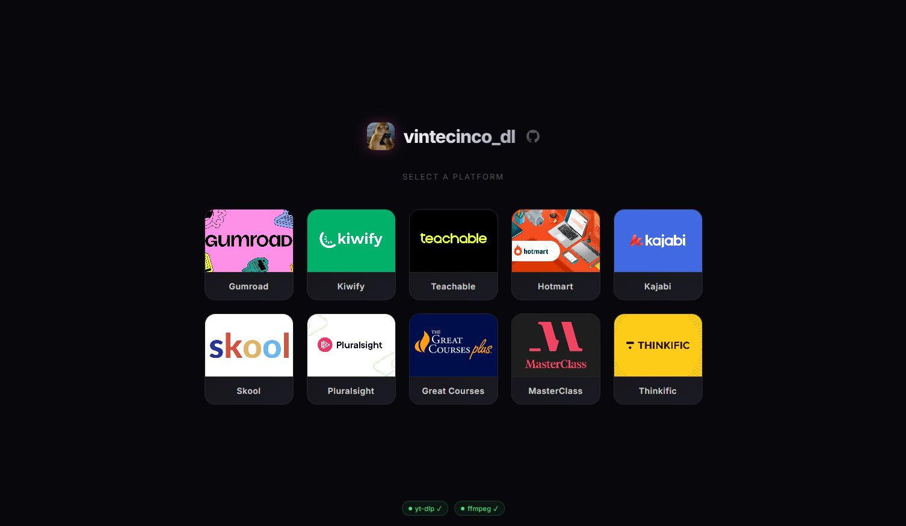
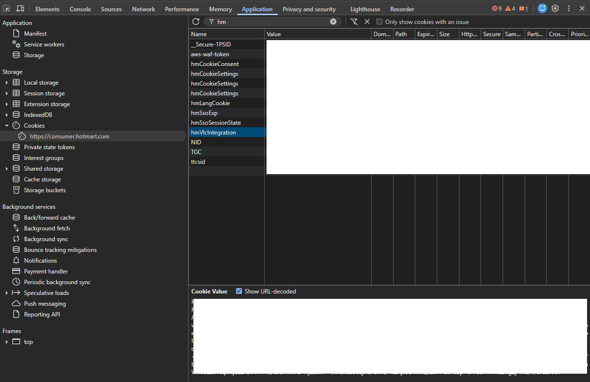
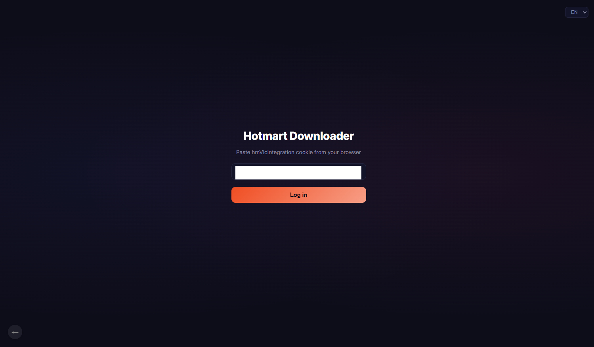
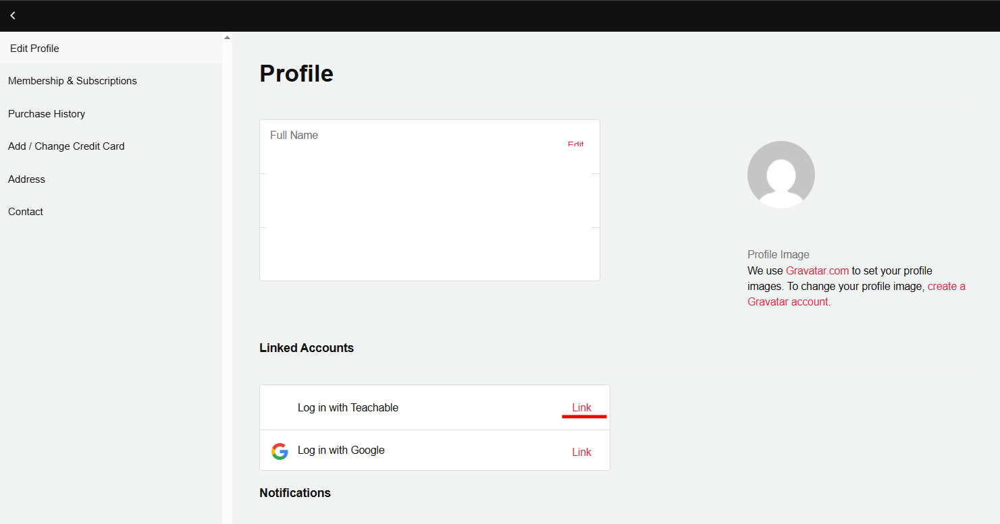
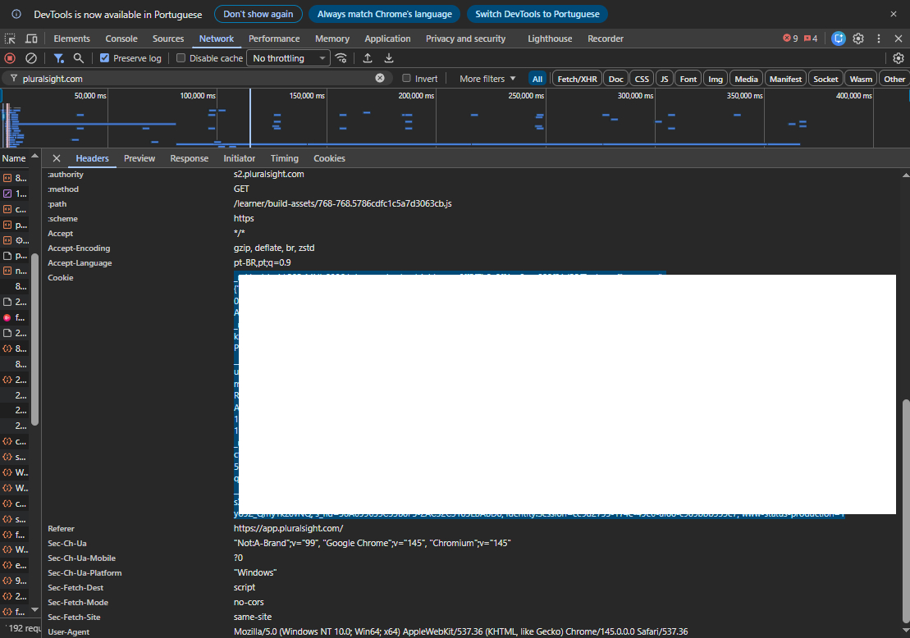
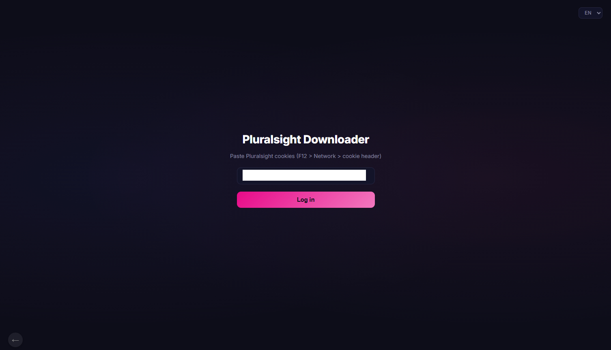
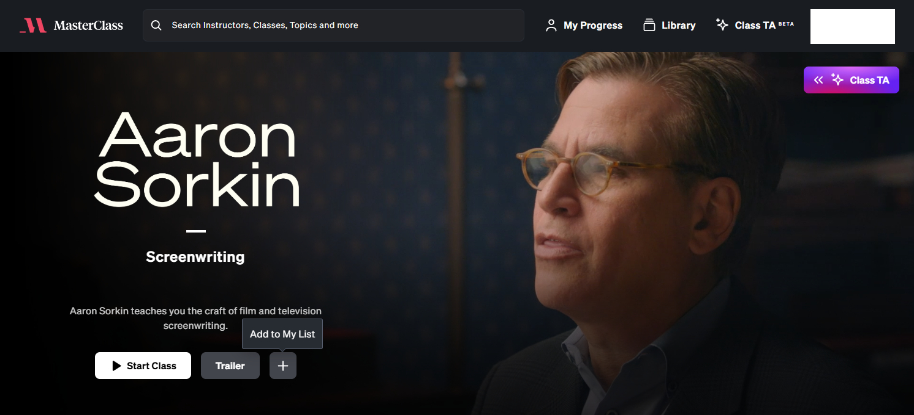
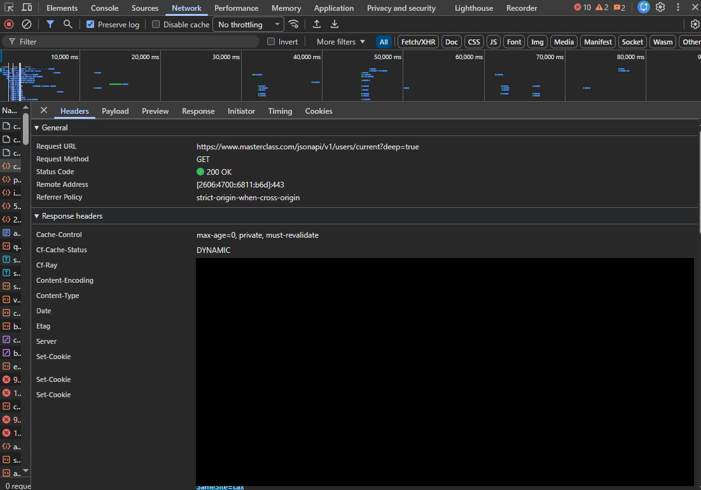
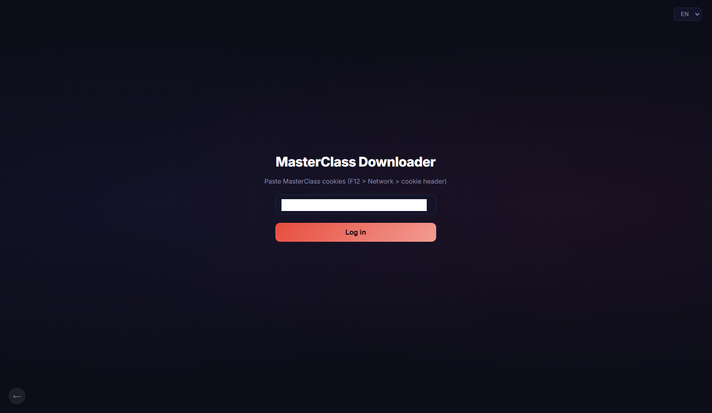
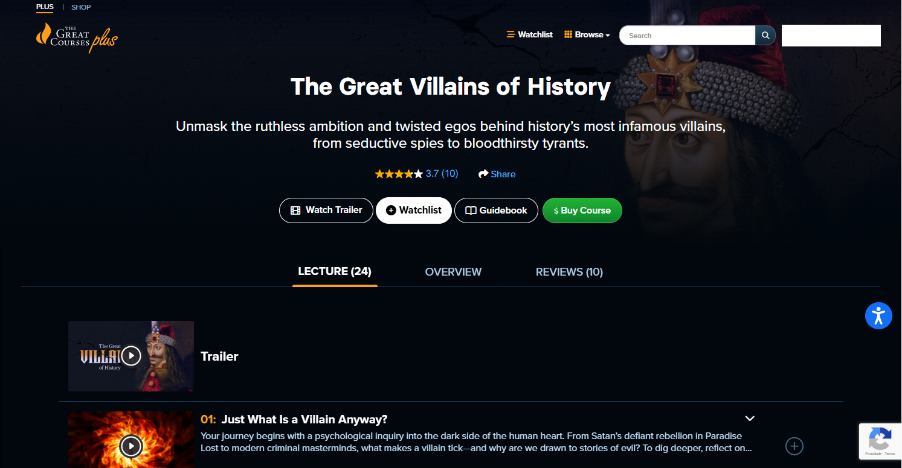

<div align="center">
  
  <h1>vintecinco_dl</h1>
  <p>Desktop app to download your purchased courses from multiple online platforms.<br>Built with <a href="https://wails.io/">Wails v2</a> (Go backend + HTML/JS frontend).</p>
</div>




[](https://github.com/owbryd/vintecinco_dl/releases/latest)

## Features

- Download videos, attachments, and descriptions from 10 platforms
- Resumable — downloads resume from where they left off
- Delete courses directly from the program
- Multi-language UI (Portuguese, English, and Spanish)

## Supported Platforms

| Platform | Auth Method |
|----------|-------------|
| **Kiwify** | Email + Password |
| **Hotmart** | Browser token |
| **Teachable** | Email + OTP code |
| **Kajabi** | Email + OTP code |
| **Gumroad** | Email + Password |
| **Pluralsight** | Browser cookies |
| **Skool** | Email + Password |
| **Great Courses** | Email + Password |
| **MasterClass** | Browser cookies |
| **Thinkific** | Interactive browser login (Chrome) |

> **Note:** This tool is intended for downloading content you have legally purchased. Please respect the terms of service of each platform.

## Requirements

- [Go 1.22+](https://go.dev/dl/)
- [yt-dlp](https://github.com/yt-dlp/yt-dlp) in PATH (used for video downloads)
- [FFmpeg](https://ffmpeg.org/) in PATH (used by yt-dlp to merge video and audio streams)
- [Google Chrome](https://www.google.com/chrome/) (required only for **Thinkific** login)

## Building from Source

### Windows

**Prerequisites:**
- [Go 1.22+](https://go.dev/dl/)

**Steps:**

1. Clone the repository:
```bash
git clone https://github.com/owbryd/vintecinco_dl.git
cd vintecinco_dl
```

2. Build the executable:
```
build.bat
```

Or if you have `make` installed (Git Bash, MSYS2, etc.):
```bash
make windows
```

3. Install [yt-dlp](https://github.com/yt-dlp/yt-dlp) and [FFmpeg](https://ffmpeg.org/) (required for video downloads):
```
winget install yt-dlp
winget install -e --id Gyan.FFmpeg
```

4. The binary will be at `build\bin\vintecinco_dl.exe`.

### Linux

**Prerequisites:**
- [Go 1.22+](https://go.dev/dl/)
- WebKit2GTK and GTK3 development libraries

Install the dependencies on **Debian/Ubuntu**:
```bash
sudo apt install libwebkit2gtk-4.1-dev libgtk-3-dev
```

On **Fedora**:
```bash
sudo dnf install webkit2gtk4.1-devel gtk3-devel
```

On **Arch**:
```bash
sudo pacman -S webkit2gtk-4.1 gtk3
```

**Steps:**

1. Clone the repository:
```bash
git clone https://github.com/owbryd/vintecinco_dl.git
cd vintecinco_dl
```

2. Build the binary:
```bash
make linux
```

Or manually:
```bash
GOOS=linux GOARCH=amd64 go build -tags "webkit2_41 desktop production" \
  -ldflags="-s -w" -o build/bin/vintecinco_dl .
```

3. Install [yt-dlp](https://github.com/yt-dlp/yt-dlp) and [FFmpeg](https://ffmpeg.org/) (required for video downloads):

**Debian/Ubuntu:**
```bash
sudo apt install yt-dlp ffmpeg
```

**Fedora:**
```bash
sudo dnf install yt-dlp ffmpeg
```

**Arch:**
```bash
sudo pacman -S yt-dlp ffmpeg
```

Or via pip on any distro (yt-dlp only, install FFmpeg separately):
```bash
pip install yt-dlp
```

4. The binary will be at `build/bin/vintecinco_dl`.

### Using Wails CLI (optional)

If you have the [Wails CLI](https://wails.io/docs/gettingstarted/installation) installed, you can also build with:
```bash
wails build
```

This also enables `wails dev` for live-reload during development.

### Makefile Targets

| Target | Description |
|--------|-------------|
| `make windows` | Build Windows `.exe` (amd64) |
| `make linux` | Build Linux binary (amd64) |
| `make test` | Run all tests |
| `make clean` | Remove build artifacts |

## Login Guide

### Gumroad

Log in with your Gumroad email and password. That's it.

### Kiwify

Log in with your Kiwify email and password. That's it.

### Hotmart

Hotmart downloader uses a token instead of email/password:

1. Open [consumer.hotmart.com](https://consumer.hotmart.com) in your browser and log in
2. Open DevTools (`F12`) > **Application** > **Cookies** > `https://consumer.hotmart.com`
3. Find the `hmVlcIntegration` cookie and copy its value



4. Paste the token in vintecinco_dl and click **Log in**



### Teachable

Teachable downloader uses an OTP code sent to your email:

1. Open your course platform in the browser
2. Go to your **Profile** page
3. Under **Linked Accounts**, click **Link** next to "Log in with Teachable" to connect your Teachable account



4. In vintecinco_dl, enter the email linked to your Teachable account
5. Check your email for the OTP code and enter it

### Kajabi

Kajabi downloader also uses an OTP code:

1. In vintecinco_dl, enter the email you used to purchase the course on the Kajabi-hosted platform
2. Check your email for the OTP code and enter it

### Pluralsight

Pluralsight downloader uses browser cookies for authentication. Only courses from your [watch history](https://app.pluralsight.com/library/history) will appear in vintecinco_dl.

1. Open [app.pluralsight.com](https://app.pluralsight.com) in your browser and log in
2. Open DevTools (`F12`) > **Network** tab
3. Find any request to `https://app.pluralsight.com` and click on it
4. In the **Headers** panel, find the `Cookie` header under **Request Headers** and copy its full value



5. Paste the cookies in vintecinco_dl and click **Log in**



### Skool

Log in with your Skool email and password. After login, your groups (communities) are listed as downloadable items — selecting a group downloads all its courses, modules, videos, and resources.

### MasterClass

MasterClass downloader is based on your library — only courses you have added to your MasterClass list will appear in vintecinco_dl.



1. Open [masterclass.com](https://www.masterclass.com) in your browser and log in
2. Open DevTools (`F12`) > **Network** tab
3. Find any request to `masterclass.com` that has a cookie starting with `_mc_session` and copy its full value



4. Paste the cookies in vintecinco_dl and click **Log in**



### Great Courses

The Great Courses downloader is based on your library — only courses you have added to your watchlist will appear in vintecinco_dl.




### Thinkific

Thinkific uses an interactive browser login via **Google Chrome**. The app opens a Chrome window and you log in normally — no tokens or cookies to copy manually.

1. Go to your course platform in the browser and copy the login page URL — it usually looks like `mycourse.com/users/sign_in`
2. Paste that URL into the **Site URL** field in vintecinco_dl
3. Click **Log in** — Chrome will open automatically on that login page
4. Complete the login in the Chrome window
5. The app detects authentication automatically and closes the browser

> **Note:** vintecinco_dl uses a dedicated Chrome profile stored at `%LOCALAPPDATA%\vintecinco_dl\chrome-profile` — separate from your personal Chrome profile, so your browsing data is never touched.

## Download Folder Structure

Downloads are resumable — if interrupted, re-running skips already-completed lessons. Course folders are marked with a `.complete` file when fully downloaded.

```
vintecinco_dl/
  Course Name/
    01 - Module Name/
      01 - Lesson Name/
        video.mp4
        description.html
        attachment.pdf
    .complete
```

## License

[MIT](LICENSE)
